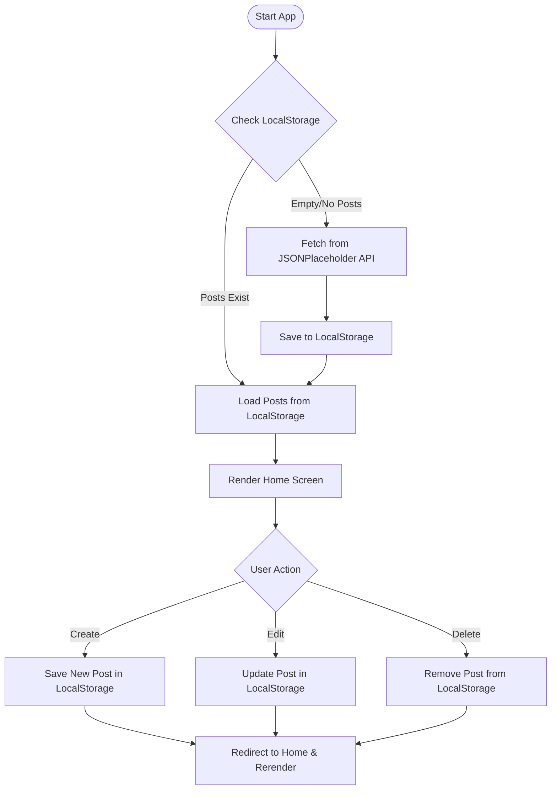

# ✍️ InkFlow

A modern, fast, and feature-rich blog application built using **React**, **Vite**, and **Vanilla CSS**. InkFlow provides a complete blogging experience, showcasing responsive design, instant local state updates, dynamic theme switching (Light/Dark mode), and integration with an external mock API.

---

## ✨ Key Features

- **⚡ Hydration from JSONPlaceholder**: On first launch, the app pulls mock blog data from the JSONPlaceholder API.
- **💾 LocalStorage Syncing**: All create, edit, and delete operations persist locally in your browser.
- **🌓 Adaptive Theme Engine**: A seamless Dark and Light theme toggle, remembering user choice via `localStorage`.
- **📱 Premium Responsive Design**: Meticulously designed with custom vanilla CSS for a fluid layout across mobile, tablet, and desktop screens.
- **🛡️ Robust Routing**: Structured multi-page routing handled efficiently via `react-router-dom`.
- **⚡ Supercharged by Vite**: Zero-lag hot module replacement (HMR) and ultra-fast build pipelines.
- **🧹 Oxlint Integration**: Out-of-the-box linting config for keeping source code clean and high-performing.

---

## 🛠️ Technology Stack

| Category | Technology |
| :--- | :--- |
| **Frontend Framework** | [React 19](https://react.dev/) |
| **Build Tooling** | [Vite 8](https://vite.dev/) |
| **Styling** | Vanilla CSS (with responsive grid, custom variables & transitions) |
| **Routing** | [React Router DOM v6](https://reactrouter.com/) |
| **HTTP Client** | [Axios](https://axios-http.com/) |
| **Linter** | [Oxlint](https://github.com/oxc-project/oxlint) |

---

## ⚙️ Data Architecture & Flow

InkFlow uses a caching mechanism to avoid redundant API calls and enable persistent local editing. Here is how the state flows:



---

## 📂 Project Structure

Here is a breakdown of the key files and folders in the workspace:

```text
BlogApp/
├── public/                 # Static assets
├── src/
│   ├── assets/             # Images and font files
│   ├── components/         # React Components
│   │   ├── CreatePost.jsx  # Form for generating a new blog post
│   │   ├── EditPost.jsx    # Form for updating an existing post
│   │   ├── Home.jsx        # Landing page displaying list of posts
│   │   └── Navbar.jsx      # Navigation header with Theme toggler
│   ├── service/
│   │   └── api.js          # Axios client instance configuration
│   ├── App.css             # Main component level styles
│   ├── App.jsx             # Route definitions and navbar layout
│   ├── index.css           # Global theme variables and design system styles
│   └── main.jsx            # React entrypoint
├── index.html              # HTML shell
├── package.json            # Node dependencies and scripts
└── vite.config.js          # Vite configuration options
```

---

## 🛠️ Getting Started

To get a local copy of InkFlow up and running, follow these steps.

### Prerequisites

Make sure you have Node.js and npm installed on your machine.
- [Node.js (LTS version recommended)](https://nodejs.org/)

### Installation

1. **Clone the repository:**
   ```bash
   git clone https://github.com/your-username/BlogApp.git
   cd BlogApp
   ```

2. **Install project dependencies:**
   ```bash
   npm install
   ```

3. **Run the development server:**
   ```bash
   npm run dev
   ```
   Open [http://localhost:5173](http://localhost:5173) in your browser to view the application.

---

## 📜 Available Scripts

In the project directory, you can run:

| Command | Description |
| :--- | :--- |
| `npm run dev` | Launches the Vite dev server with Hot Module Replacement (HMR). |
| `npm run build` | Compiles the React app into optimized static files ready for production deployment. |
| `npm run preview` | Runs a local server to preview the production build output. |
| `npm run lint` | Runs the ultra-fast Oxlint linter to detect code smell and issues. |

---

## 🎨 Theme Customization & Design System

The layout uses a comprehensive global variable system defined in [index.css](file:///e:/BlogApp/src/index.css). 

### Color Palette Config

InkFlow comes with two distinct, curated states:
- **Light Theme**: Soft background (`#f8fafc`), clean borders, dark text color, vibrant accent color.
- **Dark Theme**: Deep night theme background (`#0f172a`), sleek card colors (`#1e293b`), and white text highlights.
- **Interactive Elements**: Custom transition animations for hovers and toggles to make the experience feel premium and alive.

---

## 🤝 Contributing

Contributions make the open-source community an amazing place to learn, inspire, and create. Any contributions you make are **greatly appreciated**.

1. Fork the Project
2. Create your Feature Branch (`git checkout -b feature/AmazingFeature`)
3. Commit your Changes (`git commit -m 'Add some AmazingFeature'`)
4. Push to the Branch (`git push origin feature/AmazingFeature`)
5. Open a Pull Request

---

## 📄 License

Distributed under the MIT License. See `LICENSE` for more information.
